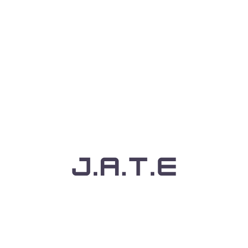

# NoteMonk

[](https://opensource.org/licenses/MIT)

<!-- PROJECT LOGO -->
<br />
<div align="center">
  <a href="https://github.com/ddprzy37/NoteMonk">
    
  </a>

<h3 align="center">NoteMonk</h3>

  <p align="center">
    NoteMonk  is a web-based text editor application developed using webpack for bundling, React for frontend components, and Express.js for the backend. It features offline capability through service workers with workbox, uses IndexedDB for local data storage, and includes a Progressive Web App (PWA) manifest for installation on compatible devices. The application automatically saves content locally when the window loses focus and caches static assets for improved performance.
    <br />
    <a href="https://github.com/ddprzy37/NoteMonk/"><strong>Explore the docs »</strong></a>
    <br />
    <br />
    <a href="https://github.com/ddprzy37/NoteMonk/">View Demo</a>
    ·
    <a href="https://github.com/ddprzy37/NoteMonk/issues/new?labels=bug&template=bug-report---.md">Report Bug</a>
    ·
    <a href="https://github.com/ddprzy37/NoteMonk/issues/new?labels=enhancement&template=feature-request---.md">Request Feature</a>
  </p>
</div>

## Description

The "NoteMonk" project is a web application designed for efficient note-taking and organization, offering users a streamlined platform to manage their notes effectively. Utilizing modern web technologies and responsive design principles, NoteMonk aims to provide a seamless user experience across various devices and screen sizes.

Key features of NoteMonk include:

* User-Friendly Interface: NoteMonk boasts an intuitive and easy-to-navigate interface, ensuring users can quickly create, edit, and organize their notes without unnecessary complexity.

* Note Management: Users can create multiple notebooks or categories to categorize their notes based on subjects, projects, or any other organizational structure that suits their needs.

* Rich Text Editing: The application supports rich text formatting capabilities, allowing users to customize their notes with various fonts, styles, colors, and multimedia content.

* Cross-Platform Accessibility: NoteMonk is accessible from any modern web browser, making it convenient for users to access their notes from desktops, laptops, tablets, and smartphones seamlessly.

* Offline Capability: Leveraging modern web technologies like service workers and IndexedDB, NoteMonk ensures that users can access and edit their notes even when offline. Changes made offline are synced automatically once the device reconnects to the internet.

* Data Security: The application prioritizes data security and privacy, implementing robust authentication mechanisms and data encryption to safeguard users' sensitive information.

* Search and Filter: NoteMonk includes powerful search and filtering capabilities, enabling users to quickly locate specific notes based on keywords, tags, or other criteria.

* Collaboration Features: For collaborative environments, NoteMonk supports sharing and collaboration on notes and notebooks, facilitating teamwork and knowledge sharing.

* Progressive Web App (PWA): By implementing PWA principles, NoteMonk offers users the option to install the application on their devices directly from the browser, enhancing accessibility and user engagement.

* Continuous Improvement: The project is maintained with regular updates and improvements based on user feedback, ensuring a robust and evolving platform that meets the dynamic needs of its users.

NoteMonk aims to empower users with a versatile note-taking solution that combines functionality, accessibility, and a seamless user experience, making it a valuable tool for personal productivity and collaborative work environments alike.mance.

- Motivation: To create a note taking application.
- Problems: Problems I faced were being able to deploy with correct scripts.


## Built With

### Programming Langueges:
* JavaScript (ES6+): Used for client-side scripting and sometimes server-side (Node.js) with frameworks like Express.
* HTML: Markup language for structuring web pages.
* CSS: Styling language for designing the application's user interface
### Development Tools and Libraries:
* Node.js: Server-side JavaScript runtime environment.
* npm (Node Package Manager): Package manager for installing and managing JavaScript libraries and tools.
* Webpack: Module bundler for JavaScript applications, used to bundle assets like JavaScript, CSS, and images.
* Babel: JavaScript compiler used to convert modern JavaScript code (ES6+) into a backward-compatible version for older browsers.
* ESLint: JavaScript linter for ensuring code quality and adherence to coding standards.
* Prettier: Code formatter for maintaining consistent code style across the project.
### Backend Technologies
* Express.js: Minimalist web framework for Node.js used for building APIs and server-side applications.
* MongoDB or MySQL/PostgreSQL: Databases for storing application data. MongoDB is a NoSQL database often used with Node.js, while MySQL and PostgreSQL are relational databases.

<p align="right">(<a href="#readme-top">back to top</a>)</p>


## Getting Started

This is an example of how you may give instructions on setting up your project locally.
To get a local copy up and running follow these simple example steps.

## Installation
1. Clone the repo
   ```sh
   git clone https://github.com/ddprzy37/NoteMonk.git
   ```
2. ```sh
    cd NoteMonk/Develop
    ```
3. Ensure you have Express and concurrently installed globally or locally:
   ```sh
   npm install -g express concurrently
   ```
4. Install NPM packages
   ```sh
   npm run build
   npm run start
   ```
5. Locally go to http://localhost:3000

<p align="right">(<a href="#readme-top">back to top</a>)</p>


See the [open issues](https://github.com/ddprzy37/NoteMonk/issues) for a full list of proposed features (and known issues).

<p align="right">(<a href="#readme-top">back to top</a>)</p>

## License

This project is licensed under the [MIT License]([MIT License](https://opensource.org/licenses/MIT)).


## Contact

Project Link: [https://github.com/ddprzy37/NoteMonk](https://github.com/ddprzy37/NoteMonk)

<p align="right">(<a href="#readme-top">back to top</a>)</p>


